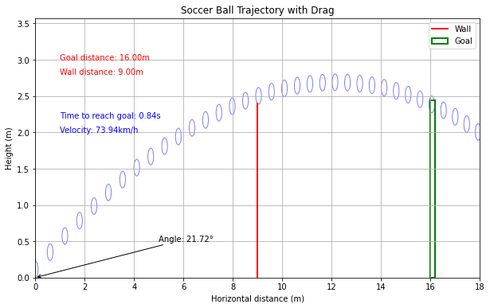

# Free Kick Simulator

This project simulates soccer free kicks with two scenarios: with and without air drag. The simulator calculates the optimal angle and velocity for the ball to reach the goal teh fastest while visualizing the trajectory.

## Notes
- I got this idea after noticing how few free kicks actually turn into goals. With all the amazing football players out there, surely there's a way to score more often.
- It’d be awesome to see this tested on an actual pitch. It doesn’t seem too hard—just need a camera to measure the angle and velocity, which should be easy to calculate.
- The results seem decent, but of course, it’s not perfect—things like spin and other factors aren’t included.
- Something feels off, though, because the two calculations don’t match exactly when drag is set to zero in the drag version.

## Features

- **Free Kick with Drag**: Simulates realistic physics including air drag.
- **Free Kick without Drag**: Uses simpler physics for a quick approximation.
- **Visualization**: Graphical representations of the ball's trajectory, the wall, and the goal.

## Examples

### Trajectory Visualization

An example plot generated by the simulator:



## Requirements

The project uses Python and several libraries for calculations and visualizations.

### Dependencies
- Python 3.8+
- matplotlib
- numpy
- scipy

Install the dependencies using:
```bash
pip install -r requirements.txt
```

## Usage

1. Clone the repository:
```bash
git clone https://github.com/yourusername/free-kick-simulator.git
cd free-kick-simulator
```

2. Run the simulations:
   - For free kicks with drag:
     ```bash
     python src/free_kick_with_drag.py
     ```
   - For free kicks without drag:
     ```bash
     python src/free_kick_calculator.py
     ```

3. View the trajectory plots to analyze the simulations.

## Project Structure
```
free-kick-simulator/
├── README.md
├── requirements.txt
├── .gitignore
├── src/
│   ├── free_kick_with_drag.py
│   ├── free_kick_calculator.py
├── LICENSE
└── examples/
    └── output_example.png
```

## Contributing

Contributions are welcome! Feel free to submit issues or pull requests.

## License

This project is licensed under the MIT License. See the `LICENSE` file for details.

## References

https://www.grc.nasa.gov/www/k-12/airplane/socdrag.html
